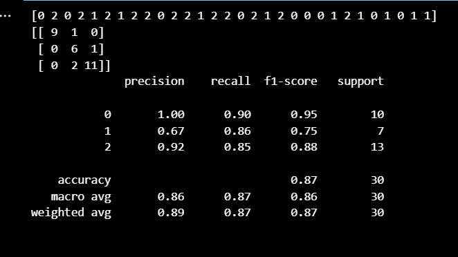

<H3>NAME:KAVINRAJA D</H3>
<H3>ROLL NO:212222240047</H3>
<H3>EX. NO.4</H3>
<H3>DATE:</H3>
<H1 ALIGN =CENTER>Implementation of MLP with Backpropagation for Multiclassification</H1>
<H3>Aim:</H3>
To implement a Multilayer Perceptron for Multi classification
<H3>Theory</H3>

A multilayer perceptron (MLP) is a feedforward artificial neural network that generates a set of outputs from a set of inputs. An MLP is characterized by several layers of input nodes connected as a directed graph between the input and output layers. MLP uses back propagation for training the network. MLP is a deep learning method.
A multilayer perceptron is a neural network connecting multiple layers in a directed graph, which means that the signal path through the nodes only goes one way. Each node, apart from the input nodes, has a nonlinear activation function. An MLP uses backpropagation as a supervised learning technique.
MLP is widely used for solving problems that require supervised learning as well as research into computational neuroscience and parallel distributed processing. Applications include speech recognition, image recognition and machine translation.
 
MLP has the following features:

Ø  Adjusts the synaptic weights based on Error Correction Rule

Ø  Adopts LMS

Ø  possess Backpropagation algorithm for recurrent propagation of error

Ø  Consists of two passes

  	(i)Feed Forward pass
	         (ii)Backward pass
           
Ø  Learning process –backpropagation

Ø  Computationally efficient method


3 Distinctive Characteristics of MLP:

Ø  Each neuron in network includes a non-linear activation function


Ø  Contains one or more hidden layers with hidden neurons

Ø  Network exhibits high degree of connectivity determined by the synapses of the network

3 Signals involved in MLP are:

 Functional Signal

*input signal

*propagates forward neuron by neuron thro network and emerges at an output signal

*F(x,w) at each neuron as it passes

Error Signal

   *Originates at an output neuron
   
   *Propagates backward through the network neuron
   
   *Involves error dependent function in one way or the other
   
Each hidden neuron or output neuron of MLP is designed to perform two computations:

The computation of the function signal appearing at the output of a neuron which is expressed as a continuous non-linear function of the input signal and synaptic weights associated with that neuron

The computation of an estimate of the gradient vector is needed for the backward pass through the network

TWO PASSES OF COMPUTATION:

In the forward pass:

•       Synaptic weights remain unaltered

•       Function signal are computed neuron by neuron

•       Function signal of jth neuron is
            
            
            


If jth neuron is output neuron, the m=mL  and output of j th neuron is
               

Forward phase begins with in the first hidden layer and end by computing ej(n) in the output layer


In the backward pass,

•       It starts from the output layer by passing error signal towards leftward layer neurons to compute local gradient recursively in each neuron

•        it changes the synaptic weight by delta rule


<H3>Algorithm:</H3>

1. Import the necessary libraries of python.

2. After that, create a list of attribute names in the dataset and use it in a call to the read_csv() function of the pandas library along with the name of the CSV file containing the dataset.

3. Divide the dataset into two parts. While the first part contains the first four columns that we assign in the variable x. Likewise, the second part contains only the last column that is the class label. Further, assign it to the variable y.

4. Call the train_test_split() function that further divides the dataset into training data and testing data with a testing data size of 20%.
Normalize our dataset. 

5. In order to do that we call the StandardScaler() function. Basically, the StandardScaler() function subtracts the mean from a feature and scales it to the unit variance.

6. Invoke the MLPClassifier() function with appropriate parameters indicating the hidden layer sizes, activation function, and the maximum number of iterations.

7. In order to get the predicted values we call the predict() function on the testing data set.

8. Finally, call the functions confusion_matrix(), and the classification_report() in order to evaluate the performance of our classifier.

<H3>Program:</H3> 

```py
import pandas as pd
import sklearn
from sklearn import preprocessing
from sklearn.model_selection import train_test_split
from sklearn.preprocessing import StandardScaler
from sklearn.neural_network import MLPClassifier
from sklearn.metrics import classification_report, confusion_matrix

url = 'https://archive.ics.uci.edu/ml/machine-learning-databases/iris/iris.data'
names = ['sepal-length', 'sepal-width', 'petal-length', 'petal-width', 'Class']
irisdata = pd.read_csv(url, names=names)
# Takes first 4 columns and assign them to variable "X"
X = irisdata.iloc[:, 0:4]
# Takes first 5th columns and assign them to variable "Y". Object dtype refers to strings.
y = irisdata.select_dtypes(include=[object])
X.head()
y.head()
# y actually contains all categories or classes:
y.Class.unique()
# Now transforming categorial into numerical values
le = preprocessing.LabelEncoder()
y = y.apply(le.fit_transform)
y.head()
# Now for train and test split (80% of  dataset into  training set and  other 20% into test data)
X_train, X_test, y_train, y_test = train_test_split(X, y, test_size = 0.20)
# Feature scaling
scaler = StandardScaler()
scaler.fit(X_train)
X_train = scaler.transform(X_train)
X_test = scaler.transform(X_test)
mlp = MLPClassifier(hidden_layer_sizes=(10, 10, 10), max_iter=1000)
mlp.fit(X_train, y_train.values.ravel())
predictions = mlp.predict(X_test)
print(predictions)
# Last thing: evaluation of algorithm performance in classifying flowers
print(confusion_matrix(y_test,predictions))
print(classification_report(y_test,predictions))
```

## OUTPUT:

### PROGRAM
```py
import pandas as pd
from sklearn.model_selection import train_test_split
from sklearn.preprocessing import StandardScaler
from sklearn.neural_network import MLPClassifier
from sklearn.metrics import classification_report
from sklearn.metrics import confusion_matrix
url = 'https://archive.ics.uci.edu/ml/machine-learning-databases/iris/iris.data'
arr = ['SepalLength', 'SepalWidth', 'PetalLength', 'PetalWidth', 'Species']
df = pd.read_csv(url, names=arr)
print(df.head())
a = df.iloc[:, 0:4]
b = df.select_dtypes(include=[object])
b = df.iloc[:,4:5]
training_a, testing_a, training_b, testing_b = train_test_split(a, b, test_size = 0.25)
myscaler = StandardScaler()
myscaler.fit(training_a)
training_a = myscaler.transform(training_a)
testing_a = myscaler.transform(testing_a)
m1 = MLPClassifier(hidden_layer_sizes=(12, 13, 14), activation='relu', solver='adam', max_iter=2500)
m1.fit(training_a, training_b.values.ravel())
predicted_values = m1.predict(testing_a)
print(confusion_matrix(testing_b,predicted_values))
print(classification_report(testing_b,predicted_values))
```
### OUTPUT:


<H3>Result:</H3>
Thus, MLP is implemented for multi-classification using python.
